_This post has since been published [here](https://www.contentful.com/blog/2018/04/09/foolproof-guide-getting-started-contentful/)_.

 

# A Day in the Life of a Customer Support Engineer

_AKA Show me how Contentful works in the most foolproof way possible._

 

Hello from the Customer Success team!

As support engineers, we tackle hundreds of user questions a month such as: _How does Contentful work? What is content modeling?_ and _How does content stored in Contentful get rendered on my web app?_ No two days are the same and it’s quite the exciting life.

So why is this blog post titled “A Day in the Life of a Customer Support Engineer”? Even though I just said “no two days are the same,” if my boss were to corner me and make me quantify what I spend most of my day doing (hypothetically, because she’s awesome and this would never happen IRL), I would have to answer: Drinking coffee (obviously) and helping new users get started with Contentful.

You see, once people understand what Contentful does, how it works, and how they can integrate it into their projects, they get into this magical, locked-in place with us where their sites are fast, their content is organized, and their build-to-ship process impressively quick. In short, our users are _really_ good at using Contentful.

However, for those of you who are just starting to kick around the idea of using Contentful as your content solution, there could be an initial courtship dance of figuring out how all of this works and what this is all about. Yes, we have very useful [getting started guides](https://www.contentful.com/developers/docs/tutorials/general/get-started/) and example apps (I highly recommend them!) but if you just want to see what Contentful does in the most foolproof way possible, well, step inside my office.

Let’s decouple Contentful from all of the cool modern web development technologies for a moment and don’t worry about picking your stack or installing packages yet. Our goal right now is to create a quick project so you can understand how Contentful works and deliver your first bit of content. Once you get a taste for what Contentful can do, it will be rainbows, sunshine, and beyond&mdash;trust me!

One of my favorite this-is-how-Contentful-works links I send to new users is a [JSFiddle](https://jsfiddle.net/contentful/kefaj4s8/) that shows the relationship between your content model, your content, and the output to your end product. Using the JSFiddle code as inspiration for our very first project together, I’ve created a template for a make-believe home goods business called Urbän Hømesteäd (when I came up with this name, I was coming off of a vacation high from a winter trip to the Scandinavian countries...what can I say).

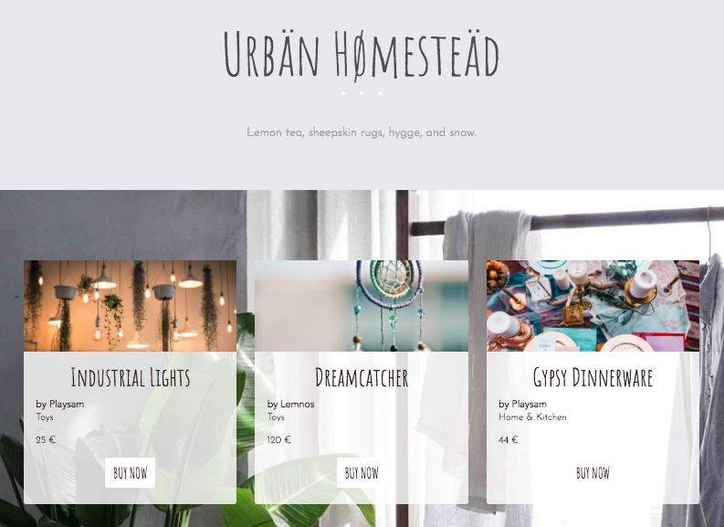

_See my version of the example product catalogue [here](https://christineywang.github.io/product-catalogue/)._

 

 

## Creating your Contentful space

Before we take a look at the project files, let’s create a new space in Contentful. When you create a space in Contentful, you can either create an empty space (so you would be building your content model from scratch) or you can create an example space that has a content model (and even some entries) already included. Example spaces are a great way for you to get started with Contentful so for this project, we will be creating an example space.

From the [web app](https://be.contentful.com/login), click on the hamburger menu on the upper left > _+ Add space_.

In the _Create a new space_ popup, click on _Create an example space_.

Select the **Product Catalogue** space > _Create space_ (don't forget to give your space a name):

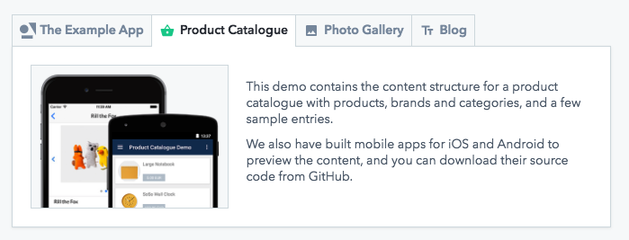

 

After your space is prepared, click on _Get started_ and...welcome to your new space! Take a look around and click into the different sections to see your content model, content, and media files. Your content model is where you will create different content types and each entry you create will use one of your content types as a template. Don't worry if this is still confusing to you&mdash;it will make sense once you see some content rendered on your web page.

Now that your space is set up, let's connect Contentful to our web project files. We will be using starter code (for our make-believe online store) and because we are taking the path of least resistance, you will not need to install any packages or run code in the command line in order to view your sample web page. All you need are these three files on your computer (download the starter code [here](cf-product-catalogue-starter.zip)):

`index.html`
`contentful.css`
`contentful.js`

 

## Authenticating Your Web Project

To enable Contentful to "speak" with your web project, we've already added our CDN in a `<script>` tag to the `<head>` element of your `.html` file. Typically, we recommend that you connect to Contentful by [installing our SDK](https://github.com/contentful/contentful.js#installation) using a package manager such as `npm`. However, since we’ve said goodbye to packages and installs and all of those other extremely-helpful-but-not-for-right-now tools, a `<script>` tag is perfect for our use case.

Next, open up `contentful.js` in a code editor so you can authenticate your web project to fetch content from Contentful. You will need to input your space ID and access token where you initialize the client in your JavaScript:

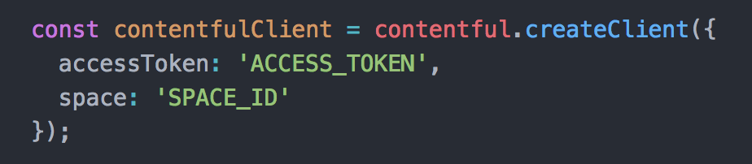

 

To find your Space ID and Delivery API access token from the web app, go to _Space settings_ > _API keys_ > _Content delivery / preview tokens_. Expand the _Example space token 1_ section and you will see your Space ID and Content Delivery API access token.

Copy and paste these values over to your code and save your file.

 

## Making your first Delivery API Call

Open the `index.html` file in your browser and BOOM.

Congrats&mdash;you've just delivered content using Contentful!

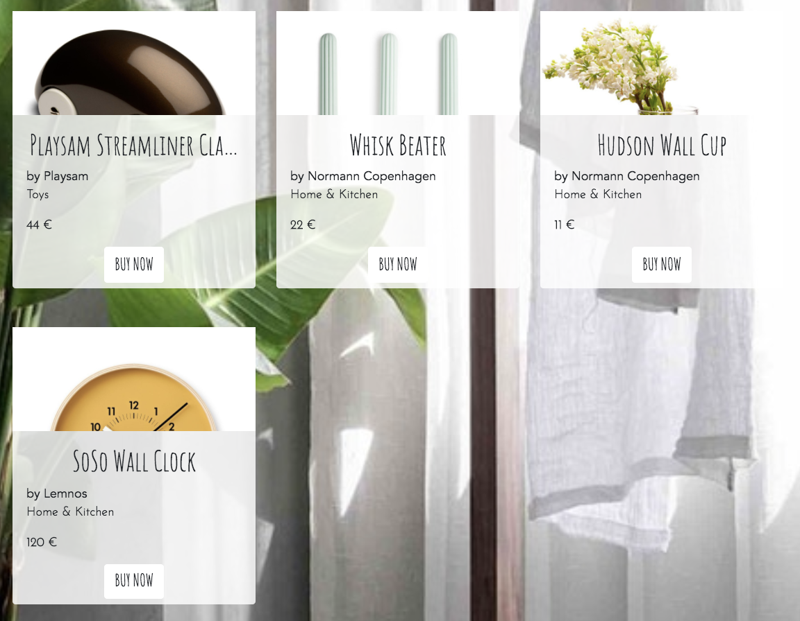

 

## Taking a Closer Look at Your Code

The four entries you see on your web page are existing entries that were populated when you created your example space. To see where these entries are coming from, go back to the web app and click into the _Content_ section. You will see a total of nine entries but in our web page, only four entries are rendered. The reason is because in our `contentful.js` file, we are only fetching entries that have the _Product_ content type, which we've queried for by using the content type ID `2PqfXUJwE8qSYKuM0U6w8M`:

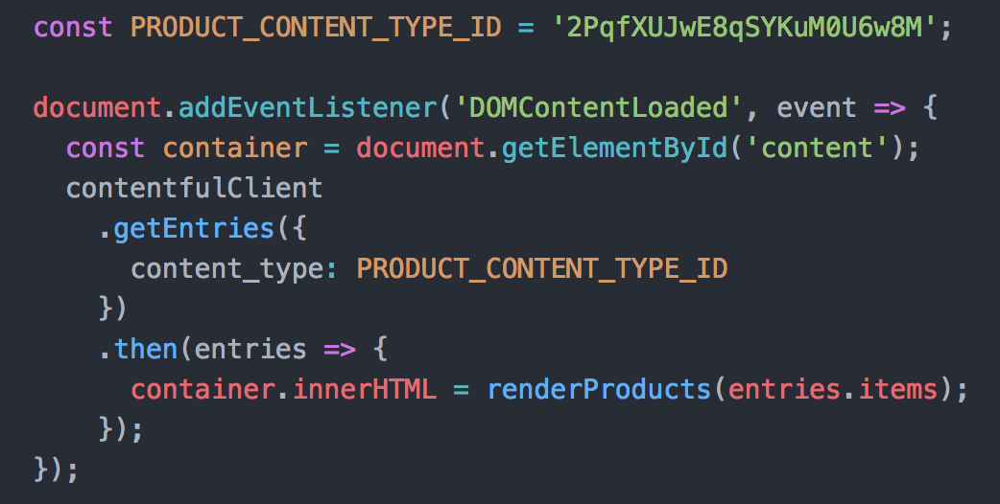

 

To simulate what your web project code is doing from the web app, apply a filter of _Content type = Product_ in the search pill and you will see the 4 entries our web page is fetching:

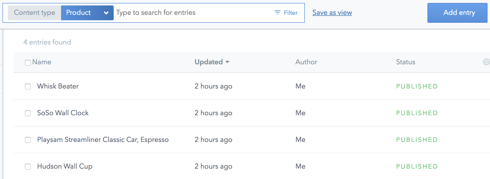

 

To understand which fields are getting rendered on your web page, take a look at the JSON response of your API call. All of the object keys are properties you can access by passing them into your code:

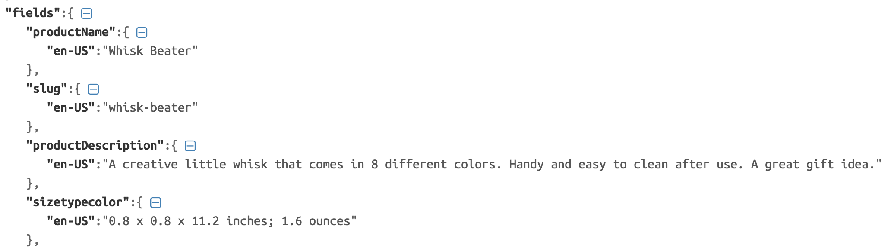

 

However, if we are just rendering one content type, why do we have three content types in our content model? To answer this question, let's go back to the web app and click into the _Whisk Beater_ entry. Scroll down a bit and you will see two fields that link to other entries: _Categories_ and _Brand_. These linked entries use the two other content types we have in our content model: _Category_ and _Brand_.

Even though we are only fetching the _Product_ content type, we have access to the other content type entries because we have reference fields in the _Product_ content type.

Take, for example, this rendered entry on your web page:

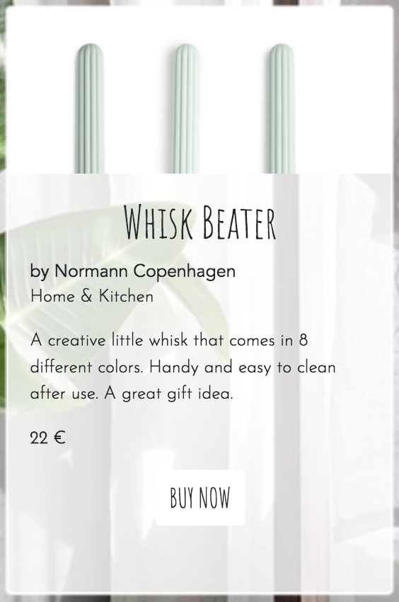

 

Right under the name of the product, we have the brand of the product (_Normann Copenhagen_) and the category of the product (_Home & Kitchen_). In our code, we are accessing this content when we pass in fields that reference other entries:

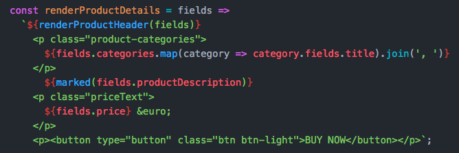

 

In a JSON response for our query, you can see that the `categories` field is a link entry that gives us access to another entry since we have the `sys.id` value of the other entry in the response:

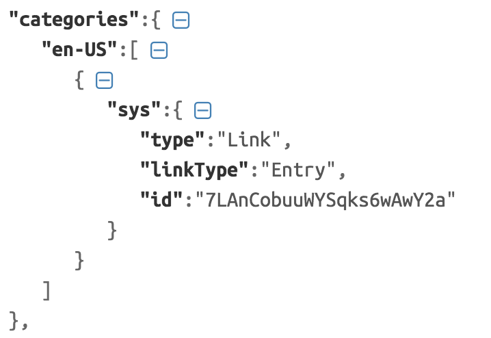

You might be able to visualize this better if you add `${console.log(fields.categories)}` to your code. In the console, you will see the properties for which you are able to access from your linked reference entries:

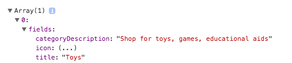

 

This concept of content types and linking entries is the foundation for understanding content modeling. At this point, I encourage you to change a few things around in your _Product_ entries. Mix up the categories and brands in your entries and see what happens on your web page.

 

## To Infinity and Beyond

Now that you've seen the relationship between Contentful and your web project, it's time to have some fun!

As you may have noticed in [my version](https://christineywang.github.io/product-catalogue/) of the product catalogue, I have a few more entries than what is included in the example space. So go ahead, create more entries from the web app and build out your sample page. Edit product names and swap in images that make more sense to you (you can add new assets by going to _Media_ > _Add asset_). As an additional exercise, edit the `contentful.js` file so you can utilize and render fields in your web page you are not currently using (such as _Slug_ and _Tags_).

Remember, what we just worked through was the most rudimentary way of showing you what Contentful can do for you. Contentful is meant to plug into frameworks such as [React](https://github.com/contentful/discovery-app-react), static site generators such as [Gatsby](https://www.gatsbyjs.org/packages/gatsby-source-contentful/), and pretty much any other project you can think of. And even though we are using just one of our APIs, we have [several more](https://www.contentful.com/developers/docs/references/) that support every stage of your development process (from staging to production).

 

There you have it, a condensed look into a day in the life of a support engineer. But the best part of my day is now up to you. We love seeing all of the cool things people build using Contentful and we learn so much from our users. So create something beautiful, do something amazing, and share it with the community; we are excited to see what you come up with.
