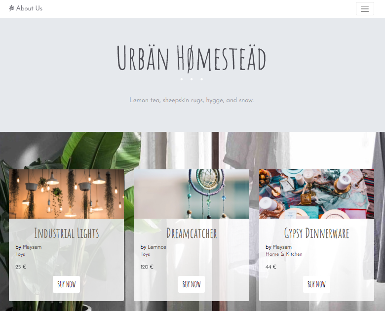
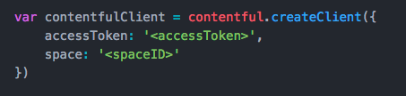

## Making Your First Contentful Delivery API Call

:warning: IN PROGRESS

As a Support Engineer for [Contentful](https://www.contentful.com/), we frequently get asked these two questions by new users:
- What is content modeling?
- How does the content that is stored in Contentful get rendered on my website?

To help us better understand the relationship between your [content model](√), the editor interface of our web app, and the output to your end product, I've created a template for a make-believe home goods business called Urbän Hømesteäd (when I came up with this name, I was just off of a vacation high from a winter trip to the Scandinavian countries...what can I say :grimacing:).

 

To make this project as easy as possible, we do not need to install packages or use the command line at all in order to view our sample web page. We will simply be using three files on your computer (`.html`, `.css`, and `.js`)--you can download the starter code here.

Let's begin!

:white_check_mark: _The JavaScript for this project is based on a previous showcase of our sample [Product Catalogue](https://github.com/contentful/product-catalogue-js). JSFiddle [here](https://jsfiddle.net/trodrigues/btvhh4ma/)._

 
 

### Table of Contents

- [Creating your Contentful space](#creating-your-contentful-space)
- [Getting your space ID and access token](#getting-your-space-id-and-access-token)
- [Making your website](#making-your-website)
- [Adding new entries to your website](#adding-new-entries-to-your-website)

  

## Creating your Contentful space
When you create a space in Contentful, you can create either an empty space (so you would be building your content model from scratch) or you can create a example space that has a content model (and even some entries) already built out.

Example spaces are a great way for you to get started with our product and further explore content modeling and best practices. In this project, we will be creating an example space.

From the web app, click on the hamburger menu on the upper left > _+ Add space_.

In the _Create a new space_ popup, click on _Create an example space_.

Select the **Product Catalogue** space > _Create space_:

 

After a few seconds, you will have a new space with a predefined content model and a few sample entries. :metal:

 

## Getting your space ID and access token

In order to connect your website with Contentful, you will need to [install Contentful](https://github.com/contentful/contentful.js#installation) to your project or include our script tag in the `<head>` element of your `html` document.

For this project, we have already included the script tag in the website code so you don't need to worry about this step.

Contentful also requires users to provide credentials in order to access content in their spaces. You will need to find your space ID and your Delivery API access token.

To get these credentials from the web app, go to _Space settings_ > _API keys_ > _Content delivery / preview tokens_.

Expand the _Example space token 1_ section and you will see your Space ID and Content Delivery API access token.

 

## Making your website

Open the `contentful.js` file in your text editor.

Replace the `accessToken` and `space` field values with your credentials:

 

Save your file.

## Adding new entries to your website

This is a sample product catalogue using Contentful to deliver content.

https://christineywang.github.io/product-catalogue/
